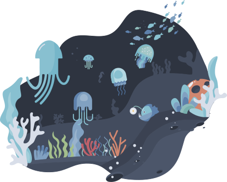

[:sweden: LÄSMIG](https://github.com/3m1l1a/3m1l1a/blob/main/README.md)

:us: README

<h2 align="center">Never swim alone in the big arctic ocean.</h2>

Submit your ideas, ask for help or <a href="https://github.com/3m1l1a/3m1l1a/discussions" alt="the repository's discussions">discuss </a>
with me here on GitHub. This repository and accompanying web pages uses the <a href="https://github.com/arcticicestudio/nord" alt="Nord color palettes">Nord color palettes</a>. The web pages are powered by <a href="https://github.com/payloadcms">Payload CMS</a> and <a href="https://github.com/withastro">Astro</a>.

<!--
The component that represents the community section of the Nord theme landing page. It handles the state for the rendered "Arctic Ocean Fractal" SVG animation component that is triggered through a waypoint with a bottom offset.

@arcticicestudio [Arctic Ice Studio](https://github.com/arcticicestudio)
@svengreb [Sven Greb](https://github.com/svengreb)

https://github.com/arcticicestudio/nord-docs/blob/main/src/components/organisms/page/landing/SectionCommunity/SectionCommunity.jsx
-->

<h1 align="center">Emilia Trollros</h1>
<!--
https://img.shields.io/static/v1?label=<LABEL>&message=<MESSAGE>&color=<COLOR>
-->

  
  
  
  
  

Is the makeup artist, experience designer and prospective full stack developer, who loves to evoke the viewers emotions with analog and digital special effects. By combining design, technology and  communication, endless possibilities are created!

As a person, I am curious, meticulous and genuinely interested in technology and fashion. I am aware of the latest trends and their possibilities and limitations. I am passionate about solving problems in new innovative ways!

  
<h2 align="center">You've found ET's home at GitHub</h2>

  

  ### Latest news and GitHub activity
  <!--
    Implement i18n in all statistics and translate into Swedish.
  -->
  

  Please be patient, the coding of this section is still in progress.

<!-- https://github.com/JasonEtco/rss-to-readme -->
<!--START_SECTION:posts-->

<!--END_SECTION:posts-->

<!-- https://github.com/jamesgeorge007/github-activity-readme -->
<!--START_SECTION:activity-->

<!--END_SECTION:activity-->

  

  ### My favorite tools
  

  
  <!--
    Badges are from: https://shields.io
    The list is inspired by: https://github.com/DenverCoder1/custom-icon-badges
  -->

#### Programming and Markup Languages
  
  <!--
  Example:
 Link a badge to the result of a search for my GitHub repositories that contain specified language:
  `https://github.com/search?q=user%3A3m1l1a+language%3ATypeScript`
  -->

  
  
  
  
  
  
  
  
  
  
  
  
  
 
  #### Frameworks and Libraries
  
  
  
  
  

  #### Databases and cloud hosting
  
  
   
  
  

  #### Software
  
  

  

  
  ### GitHub statistics
  

  > *Most used languages* is only a metric of the languages my public code consists of and doesn't reflect my experience or skill level.

  <!-- https://github.com/anuraghazra/github-readme-stats -->  
  

  
  <!-- https://github.com/denvercoder1/github-readme-streak-stats -->
  
  <!-- https://github.com/ashutosh00710/github-readme-activity-graph -->
  

